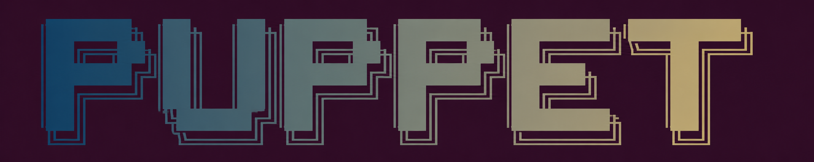

<p align="center">
  
</p>

> **P**rimitive-based **U**nified **P**latform for **P**luggable **E**mbodied **T**eleoperation

<p align="center">
  <a href="docs/README.md">Documentation</a> •
  <a href="docs/developer_guide.md">中文文档</a> •
  <a href="docs/developer_guide_en.md">English Guide</a> •
  <a href="#-快速开始">Quick Start</a> •
  <a href="#-运行示例">Demos</a>
</p>


欢迎来到 **PUPPET** 🎉

这是一个面向多关节机器人的通用遥操作运行框架。你可以把它理解成：

- 把 VR、动捕、主从臂、手柄、文件回放或外部消息统一接进来 🧩
- 用 `PrimitiveFrame` 表达设备侧控制语义 🧠
- 经过 runtime 编排、Retargeting 和机器人后端映射，输出 `ControlIntent` / final target ⚙️

---

## ✨ PUPPET 想解决什么问题？

传统遥操作系统很容易遇到这些痛点：

- 设备和机器人强耦合，换设备就要重写 😵
- 多输入源并存时，控制权和 body group 路由难管理 🧭
- 算法模块、通信模块、app 入口容易混在一起 🧱
- IK / GMR / WBC / 约束等能力分散，工程维护成本高 🔧

PUPPET 的目标是做一套**清晰、统一、可扩展、可工程落地**的遥操作 runtime 骨架 ✅

---

## 🧠 核心理念

PUPPET 最关键的一层是：`PrimitiveFrame`。

设备不直接输出某台机器人的 target，而是先输出“带控制语义的一帧输入”。后续 runtime 再按配置把它路由到对应 pipeline 和 backend。

```text
Device / Source
  -> PrimitiveFrame
  -> RuntimeChannel (Embosa / ZMQ)
  -> SourceManager
  -> Orchestrator
  -> RetargetingPipeline
  -> ControlIntent
  -> Robot Backend
  -> Final Target
```

当前仓库已经包含：

- C++ runtime 主链路 🚀
- Device Service 与 provider 抽象 🕹️
- Embosa / ZMQ 两套通信通路 📡
- `PrimitiveFrame` / `ControlIntent` 等 proto 消息 📦
- 单链 IK / GMR retargeting 相关实现 🤖
- MuJoCo visualizer 工具 👀

部分测试目录仍是占位，当前更可靠的验证方式是运行 `test/demos` 和 `scripts/` 下的启动脚本。

---

## 🗂️ 仓库结构

```text
PUPPET/
  include/puppet/        # 对外 C++ 头文件与稳定接口
  src/cpp/puppet/        # C++ 核心实现：runtime、device、transport、retargeting、backend
  app/cpp/               # C++ 可执行入口：runtime、devices、tools
  config/                # runtime、device、tools 的 YAML 配置
  proto/                 # PrimitiveFrame、ControlIntent、trajectory 等 proto 定义与生成工程
  test/                  # unit/integration 占位与 demo 验证程序
  docs/                  # 架构、接入、通信和开发文档
  scripts/               # 常用启动脚本
  third_party/           # 显式纳入仓库的三方 SDK
  devel/                 # 本地安装前缀，常用于 puppet_proto
```

---

## 🧰 环境依赖

基础工具链：

- CMake 3.20+
- C++17 编译器
- `protoc` / Protobuf（构建 `proto/` 时需要）

主工程依赖：

- `yaml-cpp`
- `Eigen3`
- `glog`
- `pinocchio`
- `qpOASES`
- `orocos-kdl`
- `trac_ik`
- `puppet_proto`
- Embosa / FastDDS 相关库
- ZMQ
- Galbot Scaled Device SDK（默认路径 `third_party/galbot_remote_operate`）

默认三方安装前缀约定为 `/opt/robot/devel/<arch-os-compiler-version>`，可通过 CMake 变量 `ROOT_DEVEL_ARCH_PATH` 覆盖。`puppet_proto` 默认会在 `devel/<arch>-Linux-GNU-<compiler-version>` 下查找。

---

## 🚀 快速开始

推荐先构建并安装 proto，再构建主工程：

```bash
./auto_build.sh --proto-only --install-proto
./auto_build.sh --main-only
```

也可以使用基础构建脚本：

```bash
./build.sh
```

或直接调用 CMake：

```bash
cmake -S . -B build
cmake --build build -j"$(nproc)"
```

常用选项：

- `-DPUPPET_BUILD_CPP_APPS=ON|OFF`：是否构建 C++ app，默认 `ON`
- `-DPUPPET_BUILD_TESTS=ON|OFF`：是否进入 `test/` 子工程，默认 `ON`
- `-DROOT_DEVEL_ARCH_PATH=/path/to/devel`：覆盖 Embosa/ZMQ 等依赖前缀
- `-DSCALED_DEVICE_SDK_ROOT=/path/to/galbot_remote_operate`：覆盖 scaled device SDK 路径

---

## 🎮 运行示例

单链 IK modular demo：

```bash
./scripts/start_single_chain_ik_modular_embosa.sh
./scripts/start_single_chain_ik_modular_zmq.sh
```

统一 Device Service 版本：

```bash
./scripts/start_single_chain_ik_modular_device_service_embosa.sh
./scripts/start_single_chain_ik_modular_device_service_zmq.sh
```

Retargeting 三节点 demo：

```bash
./scripts/start_retargeting_3nodes.sh
./scripts/start_retargeting_3nodes_zmq.sh
```

**演示动图：** [查看演示动图](docs/demo_gifs.md)

脚本通常会拉起 runtime、sender/device service 和 visualizer，日志输出到 `bin/log/`。运行前请确认相关配置文件、端口和三方动态库路径可用。

---

## 📚 文档入口

- [Documentation / 文档总览](docs/README.md)
- [开发者指南（中文）](docs/developer_guide.md)
- [Developer Guide (English)](docs/developer_guide_en.md)
- [Proto Overview](docs/proto_overview.md)
- [Runtime Channel ZMQ 接入说明](docs/runtime_channel_zmq_接入说明.md)
- [Device Service 接入与迁移记录](docs/device_service_三方库接入与源码迁移记录.md)
- [Retargeting 3-Nodes Demo](docs/retargeting_3nodes_demo.md)
- [演示动图](docs/demo_gifs.md)
- [Embosa PrimitiveFrame 收发 Demo](test/demos/cpp/README_embosa_proto_demo.md)
- [Proto Python Demo](test/demos/python/README.md)

---

## 🛠️ 开发约定

- 核心 runtime、device、transport、retargeting、backend 边界不要混放。
- 新设备优先接入 `DeviceService` provider，只在 channel 层处理 protobuf/通信封装。
- 新 retargeting 能力优先实现为 pipeline plugin，并通过 YAML 配置挂接。
- 公共接口放 `include/puppet/`，实现放 `src/cpp/puppet/`，应用拼装放 `app/cpp/`。
- 修改 C++ 后使用仓库 `.clang-format` 格式化，可参考 `format_cpp.sh`。
- 更完整的命名、分层和风格约束见 `AGENTS.md`。

---

## 🧪 测试状态

`test/unit` 和 `test/integration` 目前主要是结构占位，仓库内尚未接入实际 `add_test` / gtest 用例。当前更可靠的回归方式是构建主工程和 proto，并运行 `test/demos/cpp` 中的通信/retargeting demo 或对应脚本。

---

## 🛣️ Roadmap

- [X] 定义 `primitive_frame.proto`
- [X] 定义 `control_intent.proto`
- [X] 搭建 `teleop_runtime` 主循环
- [X] 接入 Embosa / ZMQ runtime channel
- [X] 增加 Device Service 与 provider 抽象
- [X] 增加 Recorder / Visualizer 相关工具
- [X] 增加 GMR backend / plugin 相关实现
- [ ] 补齐单元测试与集成测试用例
- [ ] 继续完善 IK / TSID / WBC / collision / constraint interface

---

## 🙌 贡献建议

欢迎 PR / Issue！

你可以从这些小任务开始：

- 补一个 `test/demos` 可复现 demo 🧪
- 给新设备增加一个 `DeviceService` provider 🕹️
- 给 `docs/` 补一页接入说明或排障记录 📝
- 为核心 runtime / retargeting 链路补单元测试 ✅

---

## 📄 License

TBD
