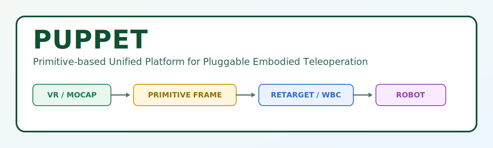

<p align="center">
  
</p>

# PUPPET

> **P**rimitive-based **U**nified **P**latform for **P**luggable **E**mbodied **T**eleoperation

欢迎来到 **PUPPET** 🎉  
这是一个面向多关节机器人的通用遥操作运行框架。你可以把它理解成：

- 把各种输入设备（VR、动捕、手柄、外部消息）统一接进来 🧩
- 用统一中间层表达控制语义（`PrimitiveFrame`）
- 经过编排 + Retargeting + 后端求解，输出机器人可执行控制目标 ⚙️

---

## ✨ PUPPET 想解决什么问题？

传统遥操作系统常见痛点：

- 设备和机器人强耦合，换设备就要重写 😵
- 多输入源并存时难以统一调度
- 算法模块（视觉/动捕/手势）难插拔
- IK / WBC / 优化能力分散，工程维护困难

PUPPET 的目标是做一套**清晰、统一、可扩展、可工程落地**的框架骨架 ✅

---

## 🧠 核心理念

PUPPET 最关键的一层是：`PrimitiveFrame`

它不是让设备直接输出某机器人 target，而是先输出统一“控制语义”，再通过后续模块映射到具体机器人执行语义。

主链路如下：

```text
Device / Source
  -> PrimitiveFrame
  -> Orchestrator
  -> Retargeting Pipeline
  -> Control Intent
  -> Robot Backend
  -> Final Target
```

---

## 🗂️ 仓库结构（新手友好版）

```text
PUPPET/
  include/puppet/        # 对外头文件（稳定接口）
  src/cpp/puppet/        # C++ 核心实现（runtime / orchestration / backend）
  src/python/            # Python 公共逻辑与算法节点支撑
  app/cpp/               # C++ 入口程序（runtime / devices / demos / tools）
  app/python/            # Python 入口 demo / 节点
  config/                # 机器人、pipeline、运行时配置
  proto/                 # PrimitiveFrame / ControlIntent 等消息定义
  test/                  # unit / integration / demos（支持小 demo）
  docs/                  # 架构与开发文档
  scripts/               # 构建、开发、发布脚本
  third_party/           # 显式管理的三方依赖
  bin/                   # 本地二进制输出目录（保留骨架，内容默认忽略）
```

---

## 🚀 快速开始

> 当前仓库处于骨架初始化阶段，先保证结构可扩展，再逐步填充实现。

### 1) 配置与编译

```bash
cmake -S . -B build
cmake --build build -j"$(nproc)"
```

也可以直接：

```bash
./build.sh
```

### 2) 目录约定速记

- 正式入口程序放 `app/*`
- 可复用实现放 `src/*`
- 验证性小 demo 可以放 `test/demos/*` 🧪
---

## 🧪 测试与 Demo 约定

`test/` 已按用途拆分：

- `test/unit/`：单元测试
- `test/integration/`：集成测试
- `test/demos/`：轻量验证 demo（快速试想法非常合适）

如果是对外展示或长期维护的 demo，建议放到 `app/*/demos`。

## 📚 Demo 列表

- [Retargeting 3-Nodes Demo](docs/retargeting_3nodes_demo.md)
- [Embosa PrimitiveFrame 收发 Demo（C++）](test/demos/cpp/README_embosa_proto_demo.md)
- [Proto Message 构造 Demo（Python）](test/demos/python/README.md)

### 单链 IK 启动脚本

- Embosa（`demo_single_chain_ik_runtime_modular.yaml`）  
  `./scripts/start_single_chain_ik_modular_embosa.sh`
- ZMQ（`demo_single_chain_ik_runtime_modular_zmq.yaml`）  
  `./scripts/start_single_chain_ik_modular_zmq.sh`

### 通信后端接入说明

- [Runtime Channel ZMQ 接入说明](docs/runtime_channel_zmq_接入说明.md)

---

## 🛣️ Roadmap

- [X] 定义 `primitive_frame.proto`
- [X] 定义 `control_intent.proto`
- [X] 搭建 `teleop_runtime` 主循环
- [ ] 实现 SourceManager 与 freshness 管理
- [ ] 实现 body-group ownership / routing
- [ ] 搭建基础 RetargetingPipeline
- [ ] 实现 DirectMappingBackend
- [X] 接入一个简单 VR / external source demo
- [X] 增加 Recorder / Visualizer
- [ ] 增加 IK backend
- [X] 增加 GMR backend
- [ ] 增加 TSID / WBC backend
- [ ] 增加 collision / constraint interface

---

## 🙌 贡献建议

欢迎 PR / Issue！

你可以从这些小任务开始：

- 补 `proto` 定义
- 增加一个 `test/demos` 小 demo
- 给 `docs/` 补一页架构说明

---

## ❓FAQ

### 为什么有很多 `.gitkeep`？

因为 Git 默认不跟踪空目录。用 `.gitkeep` 可以让目录骨架同步到远端仓库。

### `bin/` 为什么目录在仓库里但内容默认忽略？

这是为了保留结构，同时避免把本地二进制产物提交到 Git。

---

## 📄 License

TBD
